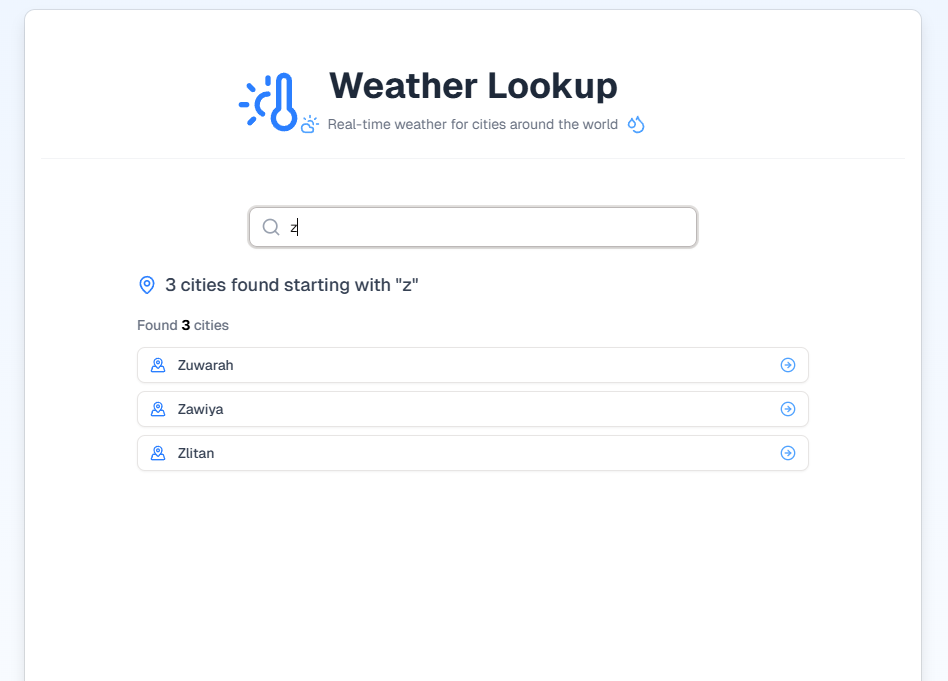
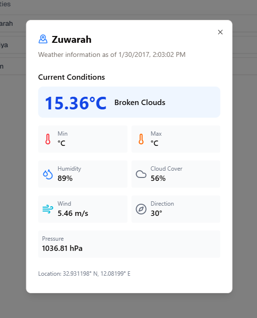

# Weather Lookup Application

A modern web application that provides weather information for cities around the world.


## Features

- Search cities by first letter
- View detailed weather information including temperature, humidity, wind, and more
- Data from OpenWeatherMap API

## Table of Contents

- [Screenshots](#screenshots)
- [Tech Stack](#tech-stack)
- [Environment Setup](#environment-setup)
- [Installation](#installation)
- [Running the Application](#running-the-application)
- [Environment Variables](#environment-variables)
- [API Usage](#api-usage)

## Screenshots

### Home Screen


### City Search Results


### Weather Details


## Tech Stack

- **Frontend Framework**: Next.js
- **Styling**: Tailwind CSS
- **State Management**: React Query
- **Icons**: Lucide React
- **Weather Data**: OpenWeatherMap API - SpringBoot API

## Environment Setup

### Prerequisites

- Node.js (v16.0 or higher)
- npm or pnpm

## Installation

1. Clone the repository:
   ```bash
   git clone https://github.com/JeffinJ/weather-app-web
   cd weather-app-web
   ```

2. Install dependencies:
   ```bash
   npm install
   # or
   pnpm install
   ```

3. Set up environment variables (see [Environment Variables](#environment-variables) section)

## Running the Application

### Development Mode

```bash
npm run dev
# or
yarn dev
```

Open [http://localhost:3000](http://localhost:3000) in your browser to see the application.

### Building for Production

```bash
npm run build
# or
yarn build
```

### Running in Production Mode

```bash
npm run start
# or
yarn start
```

## Environment Variables

Create a `.env.local` file in the root directory and add the following variables:

```bash
# SpringBoot app
NEXT_PUBLIC_API_BASE_URL=http://localhost:8080/api
```

## API Usage

The application uses the following API endpoints:

- `/api/cities/by-letter/:letter` - Get cities starting with a specific letter

---

Created by [Jeffin Jose](https://jeffinjose.dev) with ❤️